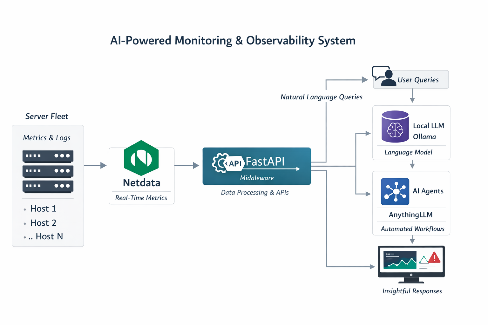

# 🧠 AI Monitoring Agent (Local AI Stack)

A fully self-hosted AI-powered monitoring system that integrates:

- 📊 Netdata (metrics collection)
- ⚡ FastAPI (middleware / API layer)
- 🤖 AnythingLLM (AI interface + agents)
- 🧠 Ollama (local LLMs like llama3)

This stack allows you to ask natural language questions like:

> "What is the CPU usage on recipe-server?"

---

## 🏗️ Architecture Overview

### Agent Flow


```
Netdata → FastAPI → AnythingLLM → Ollama
```

- Netdata collects system metrics  
- FastAPI normalizes and exposes endpoints  
- AnythingLLM calls APIs via agent flows  
- Ollama processes natural language locally  

---

## ⚙️ Features

- ✅ Fully local (no external API required)
- ✅ Natural language monitoring
- ✅ Multi-server support
- ✅ Extensible FastAPI endpoints
- ✅ Docker-based deployment
- ✅ One-command bootstrap for new VMs

---

## 📁 Project Structure

```
ai-monitoring-agent/
├── docker-compose.yml
├── bootstrap.sh
├── install-ai-stack.sh
├── fastapi/
│   ├── main.py
│   ├── routes/
│   └── services/
├── docs/
├── .env.example
├── .gitignore
└── README.md
```

---

## 🚀 Quick Start (One Command Install)

Run this on a fresh Ubuntu VM:

```bash
curl -fsSL https://raw.githubusercontent.com/gcoleman0828/ai-monitoring-agent/main/bootstrap.sh | bash
```

This will:

- Install Docker + dependencies  
- Clone the repo  
- Start containers  
- Pull `llama3`  
- Initialize environment  

---

## 🔧 Manual Installation

### 1. Clone Repo

```bash
git clone https://github.com/gcoleman0828/ai-monitoring-agent.git
cd ai-monitoring-agent
```

### 2. Run Installer

```bash
chmod +x install-ai-stack.sh
./install-ai-stack.sh
```

### 3. Access Services

| Service     | URL                    |
|-------------|------------------------|
| AnythingLLM | http://localhost:3001 |
| FastAPI     | http://localhost:8000 |
| Ollama      | http://localhost:11434 |

---

## 🤖 AnythingLLM Setup (First Time)

1. Open: http://localhost:3001  
2. Create your account  
3. Go to **Settings → LLM**  
4. Select:
   - Provider: **Ollama**
   - Model: **llama3**

---

## 🔧 Step 1: Create a New Agent Flow

1. Open AnythingLLM  
   ```
   http://localhost:3001
   ```

2. Navigate to:
   ```
   Workspace → Agent Flows
   ```

3. Click:
   ```
   + New Flow
   ```

4. Name it:
   ```
   Netdata Monitoring Agent
   ```

---

## 🔌 Step 2: Add API Call Tool

Add an **API Call block** with the following configuration:

### URL
```
http://host.docker.internal:8000/summary?host=${host}
```

### Method
```
GET
```

---

## 🧠 Step 3: Define Input Variable

Create a variable:

```
Name: host
Type: string
```

### Example values:
- recipe-server  
- ai-chatbot  
- colemanplex  

---

## 🧱 Step 4: Tool Description (CRITICAL)

Use this description to ensure the agent **always uses the tool instead of guessing**:

```
This tool MUST be used for any question related to system performance, metrics, or server health.

Always call this API to retrieve real-time data before responding.

Do NOT answer from memory or make assumptions.

Supported queries include:
- CPU usage
- Memory usage
- System status
- Server comparisons

The "host" parameter must match one of the known systems:
recipe-server, ai-chatbot, colemanplex

If the user question relates to infrastructure, monitoring, or system performance, this tool is REQUIRED.
```

---

## 🔗 Step 5: Connect Flow to Workspace

1. Go to:
   ```
   Workspace Settings → Tools
   ```

2. Add the Agent Flow as an available tool

3. Ensure it is:
   - ✅ Enabled
   - ✅ Available to the chat model

---

## 🧪 Step 6: Test the Agent

Try queries like:

```
What is the CPU usage on recipe-server?
```

```
Compare memory usage across all servers
```

```
Is any system under heavy load?
```

---

## ✅ Expected Behavior

- The agent triggers the API call  
- FastAPI queries Netdata  
- JSON response is returned  
- Ollama generates a natural language answer  

---

## 🔌 FastAPI Endpoints

```
/health
/summary?host=recipe-server
/cpu?host=recipe-server
/memory?host=recipe-server
```

---

## 🧪 Example API Response

```json
{
  "host": "recipe-server",
  "cpu_usage": 23.5,
  "memory_usage": 61.2,
  "status": "healthy"
}
```

---

## 🤖 AnythingLLM Agent Flow

```
http://host.docker.internal:8000/summary?host=${host}
```

Variable:
```
host = recipe-server
```

---

## 🧠 Example Prompts

- "What is the CPU usage on recipe-server?"
- "Compare memory usage across all servers"
- "Is any server under heavy load?"

---

## 🐳 Docker Usage

Start:
```bash
docker compose up -d
```

Stop:
```bash
docker compose down
```

View logs:
```bash
docker logs -f anythingllm
```

---

## 🔐 Environment Variables

```bash
cp .env.example .env
```

⚠️ Never commit `.env` to GitHub.

---

## 🧼 Git Workflow (Recommended)

```bash
git status
git pull --rebase origin main
git add .
git commit -m "your message"
git push origin main
```

---

## 🛠️ Troubleshooting

### Docker Permission Issue

```bash
sudo usermod -aG docker $USER
```

Log out and back in.

---

### Ollama Model Missing

```bash
docker exec -it <ollama_container> ollama pull llama3
```

---

### FastAPI Not Responding

```bash
curl http://localhost:8000/health
```

---

### Port Already in Use

```bash
sudo lsof -i :8000
```

---

## 🔮 Future Enhancements

- 📈 Anomaly detection endpoints
- 📊 Historical trend analysis
- 🚨 Alerting system
- ☁️ AWS integration
- 📦 Backup / restore flows
- 🔄 CI/CD pipeline

---

## 👤 Author

**Gregg Coleman**  
Director of Solution Architecture  
AI / Cloud / Infrastructure  

---

## ⚠️ Disclaimer

This project is for educational and internal use.  
Ensure proper security before exposing externally.
